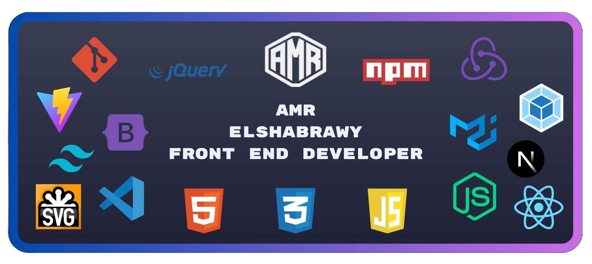
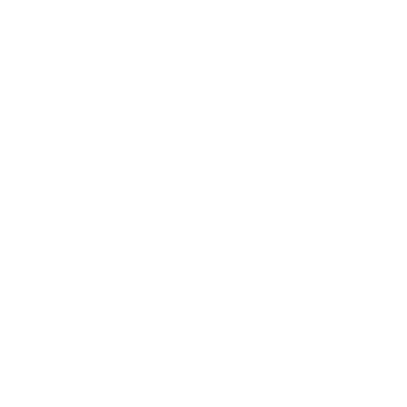

    

## 🚀 About Me

### 👨‍💻 Frontend Developer | React & Next.js Expert

Passionate Frontend Developer specializing in creating exceptional web experiences. I leverage React.js and Next.js to build performant, responsive applications that users love. My focus is on delivering clean, maintainable code and intuitive user interfaces.

#### What I Do

- 🎯 Craft pixel-perfect, responsive web applications
- 🛠️ Develop with React.js, Next.js, and TypeScript
- 📱 Create seamless mobile-first experiences
- ⚡ Optimize for performance and SEO
- 🔄 Practice agile development methodologies

#### Currently

- 📚 Mastering advanced state management patterns
- 🌐 Exploring serverless architectures
- 🤝 Open to collaboration on innovative projects
- 🔍 Seeking opportunities to create impact through code

Let's build something amazing together! 🚀

---

## 💻 Tech Stack

                         

<picture>
  <source media="(prefers-color-scheme: dark)" srcset="https://raw.githubusercontent.com/tobiasmeyhoefer/tobiasmeyhoefer/output/github-snake-dark.svg" />
  <source media="(prefers-color-scheme: light)" srcset="https://raw.githubusercontent.com/tobiasmeyhoefer/tobiasmeyhoefer/output/github-snake.svg" />
  
</picture>

---

## 📊 GitHub Statistics

  <picture>
   <source srcset="https://github-stats-alpha.vercel.app/api?username=amr-elshabrawy-dev&cc=282A36&tc=FF79C6&ic=BD93F9&bc=282A36" media="(prefers-color-scheme: dark)"/>
    <source srcset="https://github-stats-alpha.vercel.app/api?username=amr-elshabrawy-dev&cc=FFFFFF&tc=FF79C6&ic=BD93F9&bc=FFFFFF" media="(prefers-color-scheme: light)"/>
    
  </picture>
  
  

---

## Featured Projects

  
  
  
  
  

---

## 🏆 Git Profile Trophies

  

---

## 🌐 Let's Connect

  
     

---

  

    
     
     
    

      Created with 💚 and ☕ by <strong><a href="https://github.com/Amr-Elshabrawy-Dev" target="_blank" rel="noopener noreferrer">AMR ELSHABRAWY</a></strong> 
      &copy; 2025 | All Rights Reserved | Keep coding 🚀
    

  

---
